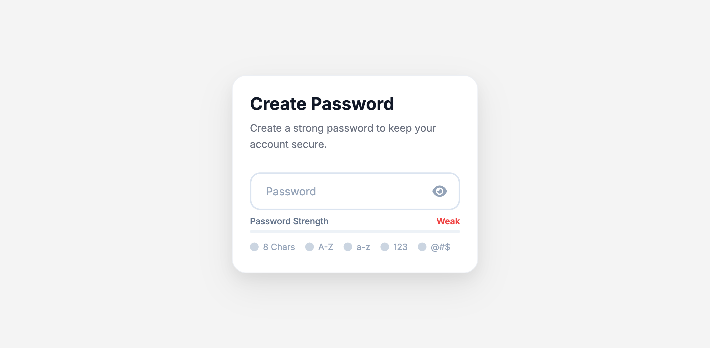

# 🔐 Password UI Upgrade | Basic vs Premium

A modern **Basic vs Premium Password UI** designed and developed by **Design & Code With AV** using **HTML, CSS, and JavaScript**.

This project demonstrates how a simple password input can be transformed into a production-ready UI with modern design, password strength validation, and an improved user experience.

---

## 📸 Preview

> Add your project preview image here.



---

## ✨ Features

### Basic Password UI

* Simple password input
* Show / Hide Password
* Minimum 8-character validation
* Error & Success states
* Clean and minimal interface

### Premium Password UI

* Modern Password UI
* Floating Label
* Show / Hide Password
* Password Strength Indicator
* Animated Progress Bar
* Live Validation Rules
* Weak / Medium / Strong States
* Responsive Design
* Production-Level UI

---

## 🛠️ Technologies Used

* HTML5
* CSS3
* JavaScript (ES6)

---

## 📁 Project Structure

```text
password-ui-upgrade/
│── index.html
│── style.css
│── script.js
│── preview.png
└── README.md
```

---

## 🚀 Getting Started

1. Clone this repository.

```bash
git clone https://github.com/DesignCodeWithAV/password-ui-upgrade.git
```

2. Open the project folder.

3. Open `index.html` in your browser.

---

## 💡 Future Improvements

* Password Generator
* Dark Mode
* Copy Password Button
* Accessibility Improvements
* More Micro Interactions

---

## 👨‍💻 Author

**Design & Code With AV**

Creating modern UI components and frontend experiences with HTML, CSS, and JavaScript.

---

## ⭐ Support

If you found this project useful, consider giving it a ⭐ on GitHub.
